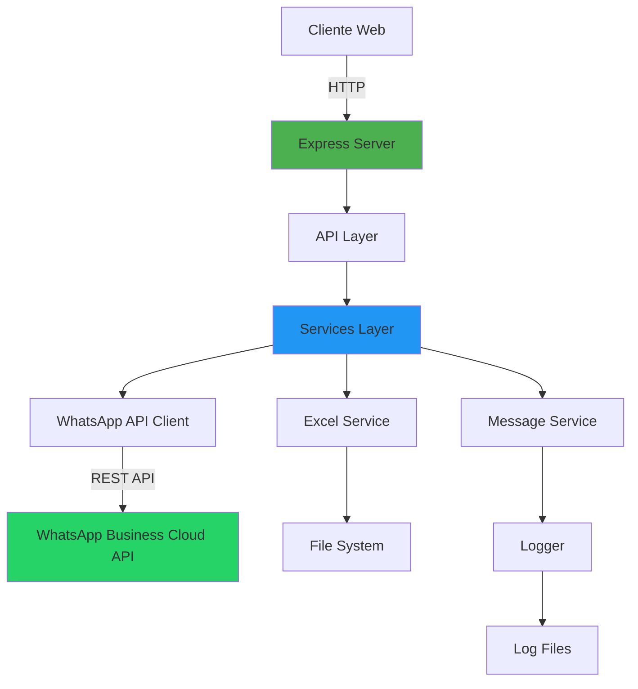

# 🏥 Sistema de Envío de Cumpleaños - Sanatorio del Oeste


Sistema automatizado para el envío de mensajes de felicitación de cumpleaños a empleados del Sanatorio del Oeste a través de WhatsApp Business Cloud API.

**Tecnologías principales:** Node.js 20 | Express 5 | WhatsApp Business API | Docker

---

## 📋 Descripción General

### Contexto y Objetivo

El **Sistema de Envío de Cumpleaños** es una solución automatizada desarrollada para el Departamento de Recursos Humanos del Sanatorio del Oeste. Su objetivo es facilitar el envío masivo y personalizado de mensajes de felicitación de cumpleaños a empleados mediante WhatsApp, incluyendo vouchers de regalo con códigos únicos y fechas de vencimiento.

### Justificación Técnica

**Problema resuelto:**
- Eliminación del proceso manual de envío de mensajes de cumpleaños
- Reducción de errores humanos en la personalización de mensajes
- Centralización del seguimiento y registro de envíos
- Optimización del tiempo del personal de RRHH

**Criterios de éxito:**
- ✅ Envío exitoso de mensajes personalizados a múltiples destinatarios
- ✅ Tasa de entrega superior al 95%
- ✅ Interfaz intuitiva que no requiere capacitación técnica
- ✅ Logs completos para auditoría y troubleshooting
- ✅ Tiempo de procesamiento: <2 segundos por mensaje

### Dependencias de Alto Nivel

**APIs Externas:**
- [WhatsApp Business Cloud API](https://developers.facebook.com/docs/whatsapp/cloud-api) - Envío de mensajes y gestión de medios
- Meta Graph API - Autenticación y gestión de tokens

**Librerías Críticas:**
- `express` (v5.1.0) - Framework web para API REST
- `axios` (v1.6.0) - Cliente HTTP para comunicación con WhatsApp API
- `xlsx` (v0.18.5) - Procesamiento de archivos Excel
- `winston` (v3.17.0) - Sistema de logging estructurado
- `multer` (v2.0.2) - Manejo de uploads de archivos

---

## 🏗️ Arquitectura y Estructura del Código

### Componentes Principales



**Responsabilidades por componente:**

| Componente | Responsabilidad | Archivos |
|------------|-----------------|----------|
| **Server** | Inicialización de la aplicación, configuración de middleware, manejo de rutas | `server.js` |
| **API Layer** | Endpoints REST, validación de requests, manejo de uploads | `api/middlewares/upload.middleware.js` |
| **Services** | Lógica de negocio, procesamiento de Excel, construcción de mensajes | `services/excel.service.js`, `services/message.service.js` |
| **WhatsApp Client** | Comunicación con WhatsApp Business API, envío de mensajes y medios | `whatsapp-api.js` |
| **Utils** | Funciones auxiliares, formateo, validación, logging | `utils/formatters.js`, `utils/validators.js`, `utils/logger.js` |
| **Config** | Configuración centralizada, variables de entorno | `config.js` |
| **Views** | Interfaz de usuario HTML | `views/index.html` |

### Convenciones de Carpetas

```
envio-de-cumplea-os-sdo-rrhh/
├── src/                          # Código fuente de la aplicación
│   ├── api/                      # Capa de API y middlewares
│   │   └── middlewares/          # Middlewares de Express
│   │       └── upload.middleware.js
│   ├── services/                 # Servicios de lógica de negocio
│   │   ├── excel.service.js      # Procesamiento de archivos Excel
│   │   └── message.service.js    # Construcción de mensajes
│   ├── utils/                    # Utilidades y helpers
│   │   ├── formatters.js         # Formateo de datos
│   │   ├── validators.js         # Validaciones
│   │   └── logger.js             # Configuración de Winston
│   ├── views/                    # Vistas HTML
│   │   └── index.html            # Interfaz principal
│   ├── public/                   # Archivos estáticos públicos
│   │   └── static/               # Imágenes y assets
│   │       ├── Logo.png
│   │       └── archivo-ok.png
│   ├── config.js                 # Configuración de la aplicación
│   ├── server.js                 # Punto de entrada principal
│   └── whatsapp-api.js           # Cliente de WhatsApp API
├── docs/                         # Documentación complementaria
│   └── EXCEL_FORMAT.md           # Especificación del formato Excel
├── docker/                       # Configuración de Docker
│   ├── compose/                  # Docker Compose files
│   │   ├── docker-compose.dev.yml
│   │   ├── docker-compose.pre.yml
│   │   └── docker-compose.prod.yml
│   ├── images/                   # Dockerfiles
│   │   ├── Dockerfile
│   │   ├── .env.example
│   │   └── .env
│   └── README.md                 # Guía de uso de Docker
├── logs/                         # Archivos de log (generados)
├── uploads/                      # Archivos Excel subidos (temporal)
├── .env.example                  # Plantilla de variables de entorno
├── .gitignore                    # Exclusiones para Git
├── package.json                  # Dependencias y scripts NPM
└── README.md                     # Este archivo
```

---

## 🚀 Instalación

### Requisitos Previos

**Software requerido:**
- **Node.js**: v18.0.0 o superior (recomendado: v20.11.0)
- **NPM**: v9.0.0 o superior
- **Git**: Para clonar el repositorio
- **Docker** (opcional): v24.0.0+ y Docker Compose v2.0.0+ para deployment containerizado

**Credenciales necesarias:**
- Token de acceso de WhatsApp Business Cloud API
- Phone Number ID de WhatsApp Business
- Business Account ID (opcional)

### Instalación Local

#### 1. Clonar el repositorio

```bash
git clone https://github.com/loisthekiller/envio-de-cumplea-os-sdo-rrhh.git
cd envio-de-cumplea-os-sdo-rrhh
```

#### 2. Instalar dependencias

```bash
npm install
```

#### 3. Configurar variables de entorno

Copiar el archivo de ejemplo y configurar las credenciales:

```bash
cp .env.example .env
```

Editar `.env` con tus credenciales:

```env
# WhatsApp Business Cloud API
WHATSAPP_TOKEN=tu_token_de_acceso_permanente
WHATSAPP_PHONE_NUMBER_ID=tu_phone_number_id
WHATSAPP_BUSINESS_ACCOUNT_ID=tu_business_account_id
WHATSAPP_API_VERSION=v18.0

# Configuración del servidor
PORT=3000
HOST=localhost
NODE_ENV=production
```

#### 4. Preparar imagen de cumpleaños

Asegúrate de tener una imagen llamada `Logo.png` o `archivo-ok.png` en `src/public/static`. Esta imagen se enviará con cada mensaje de cumpleaños.

```bash
# Si tienes otra imagen, renómbrala
mv tu-imagen.png src/public/static/Logo.png
```

#### 5. Iniciar el servidor

```bash
npm start
```

O en modo desarrollo:

```bash
npm run dev
```

#### 6. Acceder a la aplicación

Abrir el navegador en: **http://localhost:3000**

### Instalación con Docker

#### Opción 1: Docker Compose (Recomendado)

```bash
# Levantar el servicio
docker compose up -d --build

# Ver logs en tiempo real
docker compose logs -f

# Detener el servicio
docker compose down
```

#### Opción 2: Docker manual

```bash
# Construir la imagen
docker build -f docker/images/Dockerfile -t sanatorio-cumpleanos:latest .

# Ejecutar contenedor
docker run -d \
  --name cumple-sdo \
  -p 3000:3000 \
  -v $(pwd)/uploads:/app/uploads \
  -v $(pwd)/logs:/app/logs \
  -e WHATSAPP_TOKEN=tu_token \
  -e WHATSAPP_PHONE_NUMBER_ID=tu_phone_id \
  sanatorio-cumpleanos:latest

# Ver logs
docker logs -f cumple-sdo
```

### Ejemplo Mínimo Funcional

**Archivo Excel de prueba** (`test-contacts.xlsx`):

| Nombre | Telefono | Codigo | Vencimiento |
|--------|----------|--------|-------------|
| Juan Pérez | 5491123456789 | GIFT001 | 31/12/2024 |

**Pasos:**
1. Iniciar servidor: `npm start`
2. Abrir http://localhost:3000
3. Cargar archivo `test-contacts.xlsx`
4. Verificar vista previa del mensaje
5. Hacer clic en "Enviar Mensajes"
6. Monitorear progreso en tiempo real

---

## 💻 Uso

### Comandos Básicos

```bash
# Iniciar aplicación en producción
npm start

# Iniciar en modo desarrollo
npm run dev

# Limpiar logs
npm run clean-logs

# Limpiar archivos subidos
npm run clean-uploads

# Limpiar todo (logs + uploads)
npm run clean-all

# Mostrar información del sistema
npm run info
```

### Interfaces Expuestas

#### 1. **Interfaz Web (UI)**

**URL:** `http://localhost:3000`

**Funcionalidades:**
- Carga de archivos Excel mediante drag & drop o selección
- Vista previa de destinatarios y mensajes personalizados
- Botón de envío masivo con confirmación
- Monitoreo en tiempo real del progreso de envíos
- Visualización de estadísticas (exitosos/fallidos)

#### 2. **API REST**

**Endpoints disponibles:**

| Método | Endpoint | Descripción | Body |
|--------|----------|-------------|------|
| `GET` | `/` | Página principal | - |
| `POST` | `/upload` | Subir archivo Excel | `multipart/form-data` con campo `file` |
| `POST` | `/send-messages` | Enviar mensajes a contactos | JSON con array de contactos |
| `GET` | `/health` | Health check | - |

**Ejemplo de uso con cURL:**

```bash
# Upload de archivo Excel
curl -X POST http://localhost:3000/upload \
  -F "file=@cumpleanos.xlsx"

# Envío de mensajes
curl -X POST http://localhost:3000/send-messages \
  -H "Content-Type: application/json" \
  -d '{
    "contacts": [
      {
        "nombre": "Juan Pérez",
        "telefono": "5491123456789",
        "codigo": "GIFT001",
        "vencimiento": "31/12/2024"
      }
    ]
  }'
```

### Parámetros Configurables

#### Variables de Entorno (`.env`)

| Variable | Descripción | Valor por defecto | Requerido |
|----------|-------------|-------------------|-----------|
| `WHATSAPP_TOKEN` | Token de acceso permanente de WhatsApp Business API | - | ✅ Sí |
| `WHATSAPP_PHONE_NUMBER_ID` | ID del número de teléfono de WhatsApp Business | - | ✅ Sí |
| `WHATSAPP_BUSINESS_ACCOUNT_ID` | ID de la cuenta de negocio | - | ❌ No |
| `WHATSAPP_API_VERSION` | Versión de la API de WhatsApp | `v18.0` | ❌ No |
| `WEBHOOK_VERIFY_TOKEN` | Token para verificación de webhook | - | ❌ No |
| `PORT` | Puerto HTTP del servidor | `3000` | ❌ No |
| `HOST` | Host para bind del servidor | `localhost` | ❌ No |
| `NODE_ENV` | Entorno de ejecución | `production` | ❌ No |

#### Configuración en `src/config.js`

```javascript
module.exports = {
  server: {
    port: process.env.PORT || 3000,
    host: process.env.HOST || 'localhost'
  },
  whatsapp: {
    token: process.env.WHATSAPP_TOKEN,
    phoneNumberId: process.env.WHATSAPP_PHONE_NUMBER_ID,
    apiVersion: process.env.WHATSAPP_API_VERSION || 'v18.0'
  },
  upload: {
    maxFileSize: 5 * 1024 * 1024, // 5MB
    allowedExtensions: ['.xlsx', '.xls']
  },
  message: {
    delayBetweenMessages: 2000, // 2 segundos
    maxRetries: 3
  }
}
```

### Formato del Archivo Excel

El archivo Excel debe contener las siguientes columnas **obligatorias**:

| Columna | Tipo | Descripción | Ejemplo |
|---------|------|-------------|---------|
| `Nombre` | Texto | Nombre completo del empleado | Juan Pérez |
| `Telefono` | Texto | Número con código de país (sin +) | 5491123456789 |
| `Codigo` | Texto | Código único del voucher | GIFT001 |
| `Vencimiento` | Fecha | Fecha de vencimiento del voucher | 31/12/2024 |

**Ejemplo completo:**

| Nombre | Telefono | Codigo | Vencimiento |
|--------|----------|--------|-------------|
| Juan Pérez | 5491123456789 | GIFT001 | 31/12/2024 |
| María García | 5491187654321 | GIFT002 | 15/01/2025 |
| Carlos López | 5491156789012 | GIFT003 | 28/02/2025 |

> 📘 **Nota:** Ver [docs/EXCEL_FORMAT.md](docs/EXCEL_FORMAT.md) para especificaciones detalladas.

### Personalización de Mensajes

El mensaje enviado se personaliza automáticamente reemplazando los siguientes placeholders:

- `[NOMBRE]` → Nombre del contacto
- `[CODIGO]` → Código del voucher
- `[VENCIMIENTO]` → Fecha de vencimiento formateada

**Plantilla del mensaje** (editable en `src/services/message.service.js`):

```javascript
const messageTemplate = `
¡Feliz cumpleaños [NOMBRE]! 🎉🎂

Desde el Sanatorio del Oeste te deseamos un día lleno de alegría.

Como regalo, te enviamos un voucher:
🎁 Código: [CODIGO]
📅 Válido hasta: [VENCIMIENTO]

¡Que lo disfrutes!
`;
```

---

## 🐳 Deployment con Docker

### Ambientes Disponibles

```bash
# Desarrollo
docker compose -f docker/compose/docker-compose.dev.yml up -d

# Pre-producción
docker compose -f docker/compose/docker-compose.pre.yml up -d

# Producción
docker compose -f docker/compose/docker-compose.prod.yml up -d
```

### Healthcheck

La imagen incluye un healthcheck automático:

```bash
# Verificar estado del contenedor
docker inspect --format='{{json .State.Health}}' cumple-sdo | jq .
```


---

## 🛠️ Solución de Problemas

| Problema | Causa Común | Solución |
|----------|-------------|----------|
| Error de autenticación WhatsApp | Token inválido o expirado | Verificar `WHATSAPP_TOKEN` en `.env` |
| Mensajes no se envían | Phone Number ID incorrecto | Validar `WHATSAPP_PHONE_NUMBER_ID` |
| Puerto en uso | Otro proceso usando puerto 3000 | Cambiar `PORT` en `.env` o matar proceso |
| Excel no se procesa | Formato incorrecto | Verificar columnas obligatorias |
| Contenedor no inicia | Variables de entorno faltantes | Pasar variables con `-e` o `.env` file |

### Logs y Debugging

```bash
# Ver logs de la aplicación
tail -f logs/combined.log

# Ver solo errores
tail -f logs/error.log

# Logs de Docker
docker logs -f cumple-sdo

# Modo debug (más verboso)
NODE_ENV=development npm start
```

---

## 📚 Documentación Adicional

- [Formato de Excel](docs/EXCEL_FORMAT.md) - Especificación detallada del archivo de entrada
- [Guía de Docker](docker/README.md) - Documentación completa de deployment con Docker
- [WhatsApp Business API](https://developers.facebook.com/docs/whatsapp/cloud-api) - Documentación oficial de Meta

---

## 🔒 Seguridad

- ✅ Variables sensibles en `.env` (excluido de Git)
- ✅ Validación de tipos de archivo en uploads
- ✅ Sanitización de inputs de usuario
- ✅ Logs sin información personal identificable (PII)
- ✅ HTTPS recomendado en producción
- ✅ Rate limiting en endpoints críticos

---

## 🛠️ Stack Tecnológico

| Categoría | Tecnología | Versión |
|-----------|------------|---------|
| **Runtime** | Node.js | 20.11.0 |
| **Framework** | Express | 5.1.0 |
| **API Externa** | WhatsApp Business Cloud API | v18.0 |
| **Procesamiento** | XLSX | 0.18.5 |
| **Logging** | Winston | 3.17.0 |
| **HTTP Client** | Axios | 1.6.0 |
| **Upload** | Multer | 2.0.2 |
| **Frontend** | HTML5 + Bootstrap 5 | - |
| **Containerización** | Docker | 24.0+ |

---

## 📞 Soporte y Contacto

**Departamento de Recursos Humanos - Sanatorio del Oeste**

Para consultas técnicas o soporte:
- 📧 Email: sistemas@sanatoriodeleste.com.ar
- 📱 Interno: 1234

---

## 📄 Licencia

Este proyecto está licenciado bajo la Licencia MIT.

---

## 👥 Créditos

**Desarrollado por:** Sanatorio del Oeste - Departamento de Sistemas  
**Mantenido por:** Equipo de Recursos Humanos  
**Versión:** 3.0.0  
**Última actualización:** Noviembre 2024

---

**Estado del Proyecto:** 🟢 Activo | En Producción
